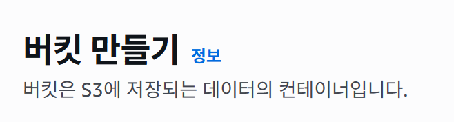
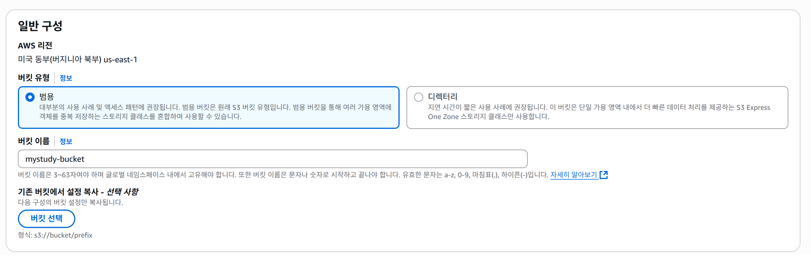
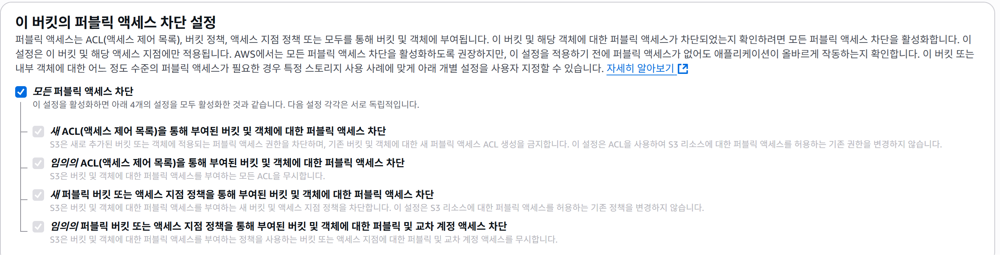
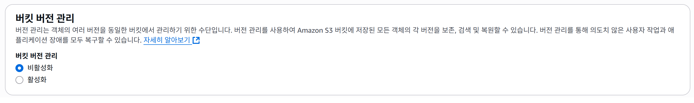
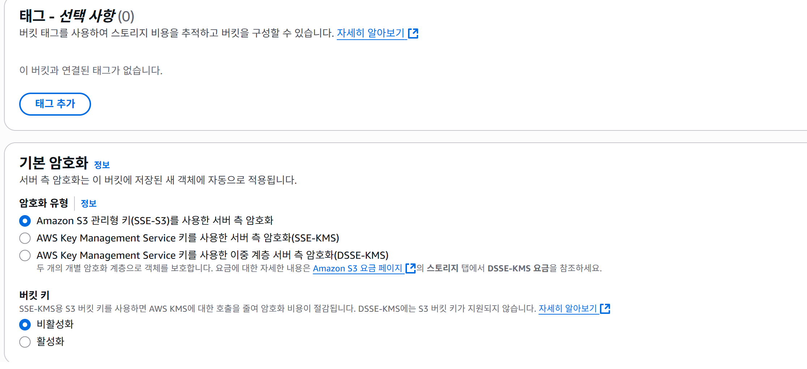
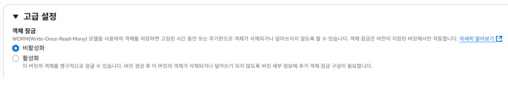

# Day02 - AWS S3 버킷 생성 실습

## 1. 버킷 이름 및 기본 설정

### 설정값
- 버킷 이름: `myawsbucket`
- 버킷 유형: 범용(Standard)
- 리전: 미국 동부 (us-east-1)
- ACL 설정: 비활성화 (AWS 기본 권장 설정)

### 선택 이유
- 버킷 이름은 S3 글로벌 고유성(중복 불가)을 맞추기 위해 짧고 유니크하게 설정
- 범용(Standard) 버킷은 다양한 애플리케이션 호환성을 위해 선택
- ACL 비활성화는 AWS 권장사항을 따르고 향후 IAM 정책으로 권한 제어하기 위해 설정

# Day 2 - AWS S3 버킷 생성 및 설정 실습

## 🏁 오늘 목표
- AWS S3 버킷 생성
- 버킷 기본 설정 구성
- 퍼블릭 액세스 차단
- 버전 관리 설정
- 기본 암호화 설정
- 객체 잠금 설정 확인

## 📅 진행 날짜
- 2025년 5월 11일

## 📌 실습 과정

### 1. S3 서비스 선택
- AWS Management Console에서 `S3` 서비스 선택
- 캡처:
  

---

### 2. 버킷 생성 시작
- **버킷 이름:** myawsbucket
- **리전:** us-east-1 (미국 동부, 버지니아 북부)
- **버킷 유형:** 범용
- 캡처:
  

---

### 3. 퍼블릭 액세스 차단 설정
- 모든 퍼블릭 액세스 차단 옵션 활성화
- 캡처:
  

---

### 4. 버전 관리 설정
- 버전 관리: **비활성화** (기본)
- 캡처:
  

---

### 5. 기본 암호화 설정
- Amazon S3 관리형 키(SSE-S3) 사용
- 캡처:
  

---

### 6. 고급 설정
- 객체 잠금: **비활성화** (기본)
- 캡처:
  

---

## ✅ 최종 확인 및 생성
- 모든 설정 검토 후 `버킷 만들기` 클릭

---

# 💬 메모
- 버킷 생성 후 퍼블릭 액세스, 버전 관리, 암호화, 객체 잠금 등의 설정이 정확히 반영되었는지 확인 필요
- 이번 실습에서는 별도 태그 추가 및 고급 암호화(KMS)는 적용하지 않음
