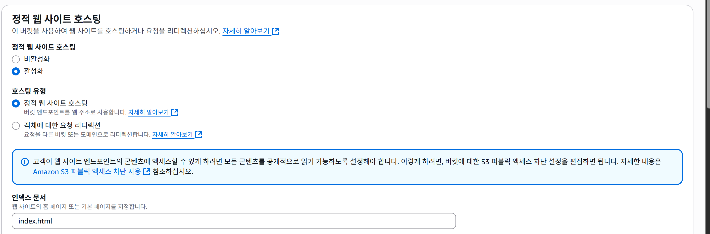
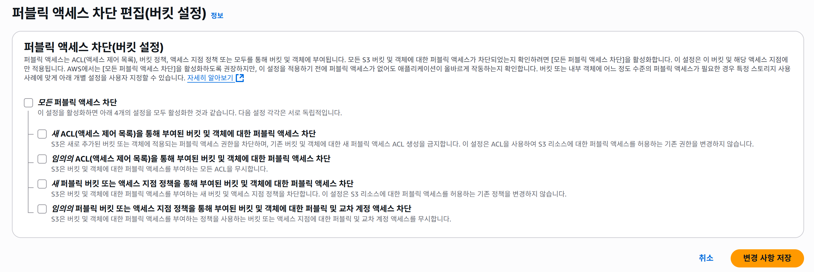
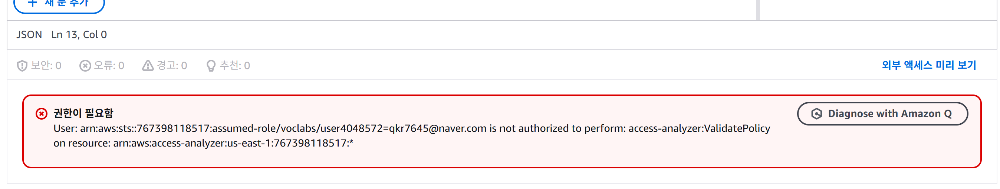
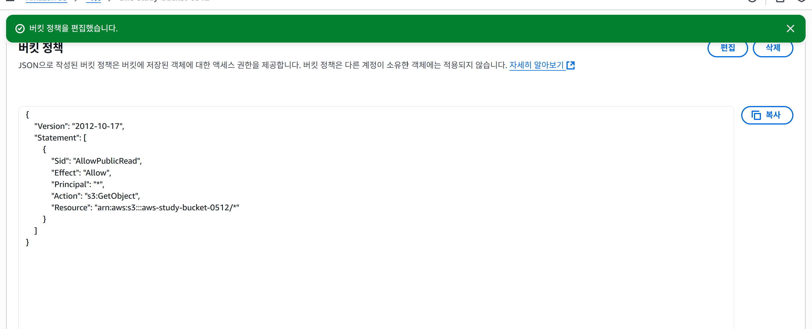
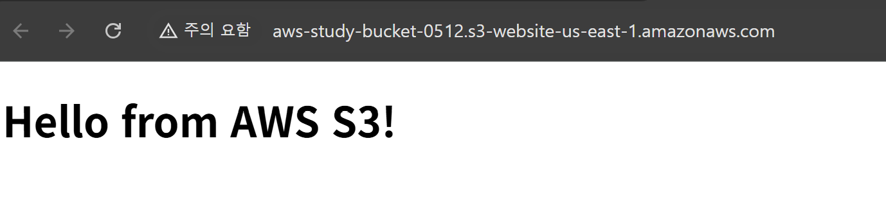

## Day3 - Step1: S3 버킷에 index.html 업로드

- 버킷 이름: aws-study-bucket-0512
- 파일명: index.html
- 저장 위치: 루트 경로
- 권한: 기본 설정 (퍼블릭 권한은 이후 버킷 정책에서 설정 예정)

업로드 성공 화면
(images/day3-upload-success.png)

## Day3 - Step2: 정적 웹사이트 호스팅 활성화

- 정적 웹사이트 호스팅: 활성화
- 인덱스 문서: index.html
- 오류 문서: error.html (현재 파일은 없지만 설정됨)
- 엔드포인트 URL은 설정 완료 후 속성 탭에서 확인 가능

캡처: 정적 웹 호스팅 설정 화면

## Day3 - Step3: 퍼블릭 액세스 차단 해제

- 정적 웹사이트 엔드포인트를 퍼블릭으로 접근 가능하게 하기 위해
  S3 버킷 퍼블릭 액세스 차단 설정 4가지 항목 모두 해제

캡처: 퍼블릭 액세스 해제 화면

## ⚠️ 버킷 정책 설정 실패 안내

- AWS Academy 실습 계정은 특정 IAM 권한(access-analyzer:ValidatePolicy)이 제한되어 있어,
  정적 웹사이트를 위한 버킷 정책 추가가 실패함
- 대안으로 index.html 객체에 직접 퍼블릭 읽기 권한을 부여하여 테스트 수행

캡처: 권한 에러 화면

## Day3 - Step4: 버킷 정책 추가

- 버킷 객체에 대해 퍼블릭 읽기 권한 허용 (s3:GetObject)
- 이를 통해 정적 웹사이트에서 index.html 접근 가능하게 설정

캡처: 버킷 정책 성공 화면

## Day3 - Step5: 정적 웹사이트 접속 확인

- 버킷의 속성 탭에서 제공된 **정적 웹사이트 엔드포인트(URL)** 를 통해 접속 테스트 진행
- index.html 정상 노출되는지 확인함

웹사이트 URL :http://aws-study-bucket-0512.s3-website-us-east-1.amazonaws.com/

- 페이지 내용: `"Hello from AWS S3!"` 출력됨
- 퍼블릭 접근 및 버킷 정책 적용 정상 작동

캡처: 웹사이트 정상 출력 화면  

